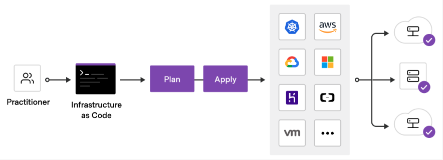

# IAC

Infrastructure as code (IaC) tools allow you to manage infrastructure with configuration files rather than through a graphical user interface. IaC allows you to build, change, and manage your infrastructure in a safe, consistent, and repeatable way by defining resource configurations that you can version, reuse, and share.

Terraform is HashiCorp's infrastructure as code tool. It lets you define resources and infrastructure in human-readable, declarative configuration files, and manages your infrastructure's lifecycle. Using Terraform has several advantages over manually managing your infrastructure:

Terraform can manage infrastructure on multiple cloud platforms.
The human-readable configuration language helps you write infrastructure code quickly.

Terraform's state allows you to track resource changes throughout your deployments.
You can commit your configurations to version control to safely collaborate on infrastructure.

<br>



<br>

## To deploy infrastructure with Terraform:

Scope - Identify the infrastructure for your project.
Author - Write the configuration for your infrastructure.
Initialize - Install the plugins Terraform needs to manage the infrastructure.
Plan - Preview the changes Terraform will make to match your configuration.
Apply - Make the planned changes.

<br>

Verify the installation
Verify that the installation worked by opening a new terminal session and listing Terraform's available subcommands.

<br>

Track your infrastructure
Terraform keeps track of your real infrastructure in a state file, which acts as a source of truth for your environment. Terraform uses the state file to determine the changes to make to your infrastructure so that it will match your configuration.

<br>

Collaborate
Terraform allows you to collaborate on your infrastructure with its remote state backends. When you use Terraform Cloud (free for up to five users), you can securely share your state with your teammates, provide a stable environment for Terraform to run in, and prevent race conditions when multiple people make configuration changes at once.

<br>

You can also connect Terraform Cloud to version control systems (VCSs) like GitHub, GitLab, and others, allowing it to automatically propose infrastructure changes when you commit configuration changes to VCS. This lets you manage changes to your infrastructure through version control, as you would with application code.

<br>

Install hashicorps homebrew packs

`brew tap hashicorp/tap`

<br>

Install terraform

`brew install hashicorp/tap/terraform`

`brew update`


Verify install

`terraform -help`

<br>

After you install Terraform and Docker on your local machine, start Docker Desktop.

`open -a Docker`

<br>

The following steps show how to install the latest version of the AWS CLI by using the standard macOS user interface and your browser.

In your browser, download the macOS pkg file: https://awscli.amazonaws.com/AWSCLIV2.pkg

```
  jasondoze@jd aws-cli % ls
  Python					aws					cryptography				libcrypto.1.1.dylib
  _awscrt.cpython-39-darwin.so		aws_completer				cryptography-36.0.2.dist-info		libssl.1.1.dylib
  _cffi_backend.cpython-39-darwin.so	`awscli`					docutils
  _ruamel_yaml.cpython-39-darwin.so	base_library.zip			lib-dynload
```

<br>

To use your IAM credentials to authenticate the Terraform AWS provider, set the AWS_ACCESS_KEY_ID environment variable.

`export AWS_ACCESS_KEY_ID=`

<br>

Now, set your secret key.

`export AWS_SECRET_ACCESS_KEY=`


Create a directory named learn-terraform-docker-container.

`mkdir terraformDockerContainer`


Then, navigate into it.

`cd terraformDockerContainer`

<br>

Paste the following Terraform configuration into a file and name it main.tf.
  ```
  Windows
  terraform {
    required_providers {
      docker = {
        source  = "kreuzwerker/docker"
        version = "~> 2.13.0"
      }
    }
  }

  provider "docker" {}

  resource "docker_image" "nginx" {
    name         = "nginx:latest"
    keep_locally = false
  }

  resource "docker_container" "nginx" {
    image = docker_image.nginx.latest
    name  = "tutorial"
    ports {
      internal = 80
      external = 8000
    }
  }
  ```
<br>

Provision the NGINX server container with apply. When Terraform asks you to confirm type yes and press ENTER.

`terraform apply`

  ```
  Do you want to perform these actions?
    Terraform will perform the actions described above.
    Only 'yes' will be accepted to approve.

    Enter a value: yes

    docker_image.nginx: Creating...
    docker_image.nginx: Creation complete after 10s [id=sha256:2d389e545974d4a93ebdef09b650753a55f72d1ab4518d17a30c0e1b3e297444nginx:latest]
    docker_container.nginx: Creating...
    docker_container.nginx: Creation complete after 1s [id=efb270cea006e3f1e683e9410781de749627ca167895caea25b0c7e5e8618a76]
  ```

<br>

Verify the existence of the NGINX container by visiting localhost:8000 in your web browser or running docker ps to see the container.

`docker ps`

<br>

  ```
  Welcome to nginx!
  If you see this page, the nginx web server is successfully installed and working. Further configuration is required.

  For online documentation and support please refer to nginx.org.
  Commercial support is available at nginx.com.

  Thank you for using nginx.
  ```


<br>

To stop the container, run terraform destroy.
`terraform destroy`
  docker_image.nginx will be destroyed
  Plan: 0 to add, 0 to change, 2 to destroy.
  Destroy complete! Resources: 2 destroyed.

<br>

Open main.tf in your text editor, paste in the configuration below, and save the file.

  ```
  terraform {
    required_providers {
      aws = {
        source  = "hashicorp/aws"
        version = "~> 4.16"
      }
    }

    required_version = ">= 1.2.0"
  }

  provider "aws" {
    region  = "us-west-2"
  }

  resource "aws_instance" "app_server" {
    ami           = "ami-830c94e3"
    instance_type = "t2.micro"

    tags = {
      Name = "ExampleAppServerInstance"
    }
  }
  ```

<br>

Terraform Block
The terraform {} block contains Terraform settings, including the required providers Terraform will use to provision your infrastructure. For each provider, the source attribute defines an optional hostname, a namespace, and the provider type. Terraform installs providers from the Terraform Registry by default. In this example configuration, the aws provider's source is defined as hashicorp/aws, which is shorthand for registry.terraform.io/hashicorp/aws.

You can also set a version constraint for each provider defined in the required_providers block. The version attribute is optional, but we recommend using it to constrain the provider version so that Terraform does not install a version of the provider that does not work with your configuration. If you do not specify a provider version, Terraform will automatically download the most recent version during initialization.

<br>

Providers
The provider block configures the specified provider, in this case aws. A provider is a plugin that Terraform uses to create and manage your resources.

You can use multiple provider blocks in your Terraform configuration to manage resources from different providers. You can even use different providers together. For example, you could pass the IP address of your AWS EC2 instance to a monitoring resource from DataDog.

Resources
Use resource blocks to define components of your infrastructure. A resource might be a physical or virtual component such as an EC2 instance, or it can be a logical resource such as a Heroku application.

Resource blocks have two strings before the block: the resource type and the resource name. In this example, the resource type is aws_instance and the name is app_server. The prefix of the type maps to the name of the provider. In the example configuration, Terraform manages the aws_instance resource with the aws provider. Together, the resource type and resource name form a unique ID for the resource. For example, the ID for your EC2 instance is aws_instance.app_server.

Resource blocks contain arguments which you use to configure the resource. Arguments can include things like machine sizes, disk image names, or VPC IDs. Our providers reference lists the required and optional arguments for each resource. For your EC2 instance, the example configuration sets the AMI ID to an Ubuntu image, and the instance type to t2.micro, which qualifies for AWS' free tier. It also sets a tag to give the instance a name.


Initialize the directory
When you create a new configuration — or check out an existing configuration from version control — you need to initialize the directory with terraform init.

Initializing a configuration directory downloads and installs the providers defined in the configuration, which in this case is the aws provider.


Initialize the directory.

`terraform init`

  Terraform has been successfully initialized!
  - Installing hashicorp/aws v4.31.0...


<br>

## Format and validate the configuration
We recommend using consistent formatting in all of your configuration files. The terraform fmt command automatically updates configurations in the current directory for readability and consistency.

Format your configuration. Terraform will print out the names of the files it modified, if any. In this case, your configuration file was already formatted correctly, so Terraform won't return any file names.

`terraform fmt`

  main.tf

<br>

You can also make sure your configuration is syntactically valid and internally consistent by using the terraform validate command.

Validate your configuration. The example configuration provided above is valid, so Terraform will return a success message.

`terraform validate`

Success! The configuration is valid.


<br>

## Create infrastructure
Apply the configuration now with the terraform apply command. Terraform will print output similar to what is shown below. We have truncated some of the output to save space.
Initialize the project, which downloads a plugin that allows Terraform to interact with Docker.

`terraform apply`

Plan: 1 to add, 0 to change, 0 to destroy.

<br>

Before it applies any changes, Terraform prints out the execution plan which describes the actions Terraform will take in order to change your infrastructure to match the configuration.

The output format is similar to the diff format generated by tools such as Git. The output has a + next to aws_instance.app_server, meaning that Terraform will create this resource. Beneath that, it shows the attributes that will be set. When the value displayed is (known after apply), it means that the value will not be known until the resource is created. For example, AWS assigns Amazon Resource Names (ARNs) to instances upon creation, so Terraform cannot know the value of the arn attribute until you apply the change and the AWS provider returns that value from the AWS API.

Terraform will now pause and wait for your approval before proceeding. If anything in the plan seems incorrect or dangerous, it is safe to abort here before Terraform modifies your infrastructure.

In this case the plan is acceptable, so type yes at the confirmation prompt to proceed. Executing the plan will take a few minutes since Terraform waits for the EC2 instance to become available.

```
aws_instance.app_server: Creating...
aws_instance.app_server: Still creating... [10s elapsed]
aws_instance.app_server: Still creating... [20s elapsed]
aws_instance.app_server: Still creating... [30s elapsed]
aws_instance.app_server: Still creating... [40s elapsed]
aws_instance.app_server: Creation complete after 43s [id=i-000a0ef01cca62a03]
```
<br>

Apply complete! Resources: 1 added, 0 changed, 0 destroyed.

<br>

You have now created infrastructure using Terraform! Visit the EC2 console and find your new EC2 instance.
  Instance state
  Running

<br>

## Inspect state
When you applied your configuration, Terraform wrote data into a file called terraform.tfstate. Terraform stores the IDs and properties of the resources it manages in this file, so that it can update or destroy those resources going forward.

<br>

The Terraform state file is the only way Terraform can track which resources it manages, and often contains sensitive information, so you must store your state file securely and restrict access to only trusted team members who need to manage your infrastructure. In production, we recommend storing your state remotely with Terraform Cloud or Terraform Enterprise. Terraform also supports several other remote backends you can use to store and manage your state.

<br>

Inspect the current state using terraform show

`terraform show`

# aws_instance.app_server:
```
resource "aws_instance" "app_server" {
    ami                                  = "ami-830c94e3"
    arn                                  = "arn:aws:ec2:us-west-2:996816848043:instance/i-000a0ef01cca62a03"
    associate_public_ip_address          = true
    availability_zone                    = "us-west-2a"
    cpu_core_count                       = 1
    cpu_threads_per_core                 = 1
    disable_api_stop                     = false
    disable_api_termination              = false
    ebs_optimized                        = false
    get_password_data                    = false
    hibernation                          = false
    id                                   = "i-000a0ef01cca62a03"
    instance_initiated_shutdown_behavior = "stop"
    instance_state                       = "running"
    instance_type                        = "t2.micro"
    ipv6_address_count                   = 0
    ipv6_addresses                       = []
    monitoring                           = false
    primary_network_interface_id         = "eni-0af42a4ec83059520"
    private_dns                          = "ip-172-31-25-38.us-west-2.compute.internal"
    private_ip                           = "172.31.25.38"
    public_dns                           = "ec2-54-244-176-55.us-west-2.compute.amazonaws.com"
    public_ip                            = "54.244.176.55"
    secondary_private_ips                = []
    security_groups                      = [
        "default",
    ]
    source_dest_check                    = true
    subnet_id                            = "subnet-0bc9c248da5306bc4"
    tags                                 = {
        "Name" = "ExampleAppServerInstance"
    }
    tags_all                             = {
        "Name" = "ExampleAppServerInstance"
    }
    tenancy                              = "default"
    user_data_replace_on_change          = false
    vpc_security_group_ids               = [
        "sg-07856ccd056ec2018",
    ]

    capacity_reservation_specification {
        capacity_reservation_preference = "open"
    }

    credit_specification {
        cpu_credits = "standard"
    }

    enclave_options {
        enabled = false
    }

    maintenance_options {
        auto_recovery = "default"
    }

    metadata_options {
        http_endpoint               = "enabled"
        http_put_response_hop_limit = 1
        http_tokens                 = "optional"
        instance_metadata_tags      = "disabled"
    }

    private_dns_name_options {
        enable_resource_name_dns_a_record    = false
        enable_resource_name_dns_aaaa_record = false
        hostname_type                        = "ip-name"
    }

    root_block_device {
        delete_on_termination = true
        device_name           = "/dev/sda1"
        encrypted             = false
        iops                  = 0
        tags                  = {}
        throughput            = 0
        volume_id             = "vol-045d91e2674d95682"
        volume_size           = 8
        volume_type           = "standard"
    }
```

<br>

When Terraform created this EC2 instance, it also gathered the resource's metadata from the AWS provider and wrote the metadata to the state file. Later in this collection, you will modify your configuration to reference these values to configure other resources and output values.

<br>

Manually Managing State
Terraform has a built-in command called terraform state for advanced state management. Use the list subcommand to list of the resources in your project's state.

`terraform state list`

aws_instance.app_server

<br>

## Troubleshooting
If terraform validate was successful and your apply still failed, you may be encountering one of these common errors.

If you use a region other than us-west-2, you will also need to change your ami, since AMI IDs are region-specific. Choose an AMI ID specific to your region by following these instructions, and modify main.tf with this ID. Then re-run terraform apply.

If you do not have a default VPC in your AWS account in the correct region, navigate to the AWS VPC Dashboard in the web UI, create a new VPC in your region, and associate a subnet and security group to that VPC. Then add the security group ID (vpc_security_group_ids) and subnet ID (subnet_id) arguments to your aws_instance resource, and replace the values with the ones from your new security group and subnet.

```
 resource "aws_instance" "app_server" {
   ami                    = "ami-830c94e3"
   instance_type          = "t2.micro"
+  vpc_security_group_ids = ["sg-0077..."]
+  subnet_id              = "subnet-923a..."
 }
```

<br>

Save the changes to main.tf, and re-run terraform apply.

<br>

Remember to add these lines to your configuration for the rest of the tutorials in this collection. For more information, review this document from AWS on working with VPCs.

<br>

Infrastructure is continuously evolving, and Terraform helps you manage that change. As you change Terraform configurations, Terraform builds an execution plan that only modifies what is necessary to reach your desired state.

<br>

Paste the following configuration into a file named main.tf.

  ```
  terraform {
    required_providers {
      aws = {
        source  = "hashicorp/aws"
        version = "~> 4.16"
      }
    }

    required_version = ">= 1.2.0"
  }

  provider "aws" {
    region  = "us-west-2"
  }

  resource "aws_instance" "app_server" {
    ami           = "ami-830c94e3"
    instance_type = "t2.micro"

    tags = {
      Name = "ExampleAppServerInstance"
    }
  }
```
<br>

Initialize the configuration.

`terraform init`

<br>

Apply the configuration.

`terraform apply`


## Configuration
Now update the ami of your instance. Change the aws_instance.app_server resource under the provider block in main.tf by replacing the current AMI ID with a new one.

  `ami           = "ami-08d70e59c07c61a3a"`

<br>

Tip: The below snippet is formatted as a diff to give you context about which parts of your configuration you need to change. Replace the content displayed in red with the content displayed in green, leaving out the leading + and - signs.

<br>

This update changes the AMI to an Ubuntu 16.04 AMI. The AWS provider knows that it cannot change the AMI of an instance after it has been created, so Terraform will destroy the old instance and create a new one.

`-/+ resource "aws_instance" "app_server" {`

<br>

The prefix -/+ means that Terraform will destroy and recreate the resource, rather than updating it in-place. Terraform can update some attributes in-place (indicated with the ~ prefix), but changing the AMI for an EC2 instance requires recreating it. Terraform handles these details for you, and the execution plan displays what Terraform will do.

<br>

Additionally, the execution plan shows that the AMI change is what forces Terraform to replace the instance. Using this information, you can adjust your changes to avoid destructive updates if necessary.

<br>

Once again, Terraform prompts for approval of the execution plan before proceeding. Answer yes to execute the planned steps.

`Plan: 1 to add, 0 to change, 1 to destroy.`

`Apply complete! Resources: 1 added, 0 changed, 1 destroyed.`

<br>

```
EC2 Instance
Instance state
 Terminated

Instance state
 Running
```

<br>

As indicated by the execution plan, Terraform first destroyed the existing instance and then created a new one in its place. You can use terraform show again to have Terraform print out the new values associated with this instance.

`terraform show`


## Destroy
The terraform destroy command terminates resources managed by your Terraform project. This command is the inverse of terraform apply in that it terminates all the resources specified in your Terraform state. It does not destroy resources running elsewhere that are not managed by the current Terraform project.

<br>

Destroy the resources you created.

`terraform destroy`

<br>

Destroy complete! Resources: 1 destroyed.

```
ExampleAppServerInstance
i-000a0ef01cca62a03	
Terminated
t2.micro	–	
No alarms
us-west-2a	–	–	–	–	disabled	–	–	2022/09/16 19:46 GMT-5

ExampleAppServerInstance
i-0954c0d1f4eba12e9	
Terminated
t2.micro	–	
No alarms
us-west-2a	- -	–	–	disabled	–	–	2022/09/16 20:12 GMT-5
```

<br>

## Set the instance name with a variable
The current configuration includes a number of hard-coded values. Terraform variables allow you to write configuration that is flexible and easier to re-use.

<br>

Add a variable to define the instance name.

Create a new file called variables.tf with a block defining a new instance_name variable.

`touch variables.tf`

<br>

  ```
  variable "instance_name" {
  description = "Value of the Name tag for the EC2 instance"
  type        = string
  default     = "ExampleAppServerInstance"
}
  ```


In main.tf, update the aws_instance resource block to use the new variable. The instance_name variable block will default to its default value ("ExampleAppServerInstance") unless you declare a different value.

```
 resource "aws_instance" "app_server" {
   ami           = "ami-08d70e59c07c61a3a"
   instance_type = "t2.micro"

   tags = {
-    Name = "ExampleAppServerInstance"
+    Name = var.instance_name
   }
 }
```

<br>

## Apply your configuration
Apply the configuration. Respond to the confirmation prompt with a yes.


`Plan: 1 to add, 0 to change, 0 to destroy.
Apply complete! Resources: 1 added, 0 changed, 0 destroyed.`

<br>

Now apply the configuration again, this time overriding the default instance name by passing in a variable using the -var flag. Terraform will update the instance's Name tag with the new name. Respond to the confirmation prompt with yes.

`terraform apply -var "instance_name=YetAnotherName"`

<br>

`Plan: 0 to add, 1 to change, 0 to destroy.
Apply complete! Resources: 0 added, 1 changed, 0 destroyed.`

<br>

Setting variables via the command-line will not save their values. Terraform supports many ways to use and set variables so you can avoid having to enter them repeatedly as you execute commands. To learn more, follow our in-depth tutorial, Customize Terraform Configuration with Variables.

<br>

Query Data with Outputs

  ```
  terraform init
  terraform apply
  ```


## Output EC2 instance configuration
Create a file called outputs.tf in your learn-terraform-aws-instance directory.

<br>

Add the configuration below to outputs.tf to define outputs for your EC2 instance's ID and IP address.

  ```
  output "instance_id" {
  description = "ID of the EC2 instance"
  value       = aws_instance.app_server.id
}

output "instance_public_ip" {
  description = "Public IP address of the EC2 instance"
  value       = aws_instance.app_server.public_ip
}
  ```

<br>

## Inspect output values
You must apply this configuration before you can use these output values. Apply your configuration now. Respond to the confirmation prompt with yes.

```
Changes to Outputs:
  + instance_id        = "i-01dc360e6567556e9"
  + instance_public_ip = "34.220.171.251"
```

<br>


Terraform prints output values to the screen when you apply your configuration. Query the outputs with the terraform output command.

`terraform output`

`instance_id = "i-01dc360e6567556e9"`

`instance_public_ip = "34.220.171.251"`

<br>

You can use Terraform outputs to connect your Terraform projects with other parts of your infrastructure, or with other Terraform projects. To learn more, follow our in-depth tutorial, Output Data from Terraform.

<br>

## Store Remote State
Now you have built, changed, and destroyed infrastructure from your local machine. This is great for testing and development, but in production environments you should keep your state secure and encrypted, where your teammates can access it to collaborate on infrastructure. The best way to do this is by running Terraform in a remote environment with shared access to state.

<br>

Terraform Cloud allows teams to easily version, audit, and collaborate on infrastructure changes. It also securely stores variables, including API tokens and access keys, and provides a safe, stable environment for long-running Terraform processes.

In this tutorial, you will migrate your state to Terraform Cloud.

Set up Terraform Cloud
If you have a HashiCorp Cloud Platform or Terraform Cloud account, log in using your existing credentials. For more detailed instructions on how to sign up for a new account and create an organization, review the Sign up for Terraform Cloud tutorial.

<br>

Next, modify main.tf to add a cloud block to your Terraform configuration, and replace organization-name with your organization name.

  ```
  terraform {
  cloud {
    organization = "organization-name"
    workspaces {
      name = "learn-tfc-aws"
    }
  }

  required_providers {
    aws = {
      source  = "hashicorp/aws"
      version = "~> 4.16"
    }
  }
}
  ```


## Login to Terraform Cloud
Next, log into your Terraform Cloud account with the Terraform CLI in your terminal.

`terraform login`

<br>

Terraform will request an API token for app.terraform.io using your browser.

If login is successful, Terraform will store the token in plain text in the following file for use by subsequent commands:
` /Users/<USER>/.terraform.d/credentials.tfrc.json`

<br>

Confirm with a yes and follow the workflow in the browser window that will automatically open. You will need to paste the generated API key into your Terminal when prompted. For more detail on logging in, follow the Authenticate the CLI with Terraform Cloud tutorial.

terraform token ............
```
.............


Token for app.terraform.io:
  Enter a value: 

Welcome to Terraform Cloud!  
Retrieved token for user jdoze
```

<br>


## Initialize Terraform
Now that you have configured your Terraform Cloud integration, run terraform init to re-initialize your configuration and migrate your state file to Terraform Cloud. Enter "yes" when prompted to confirm the migration.

`terraform init`

<br>

Now that Terraform has migrated the state file to Terraform Cloud, delete the local state file.

`rm terraform.tfstate`

<br>

When using Terraform Cloud with the CLI-driven workflow, you can choose to have Terraform run remotely, or on your local machine. When using local execution, Terraform Cloud will execute Terraform on your local machine and remotely store your state file in Terraform Cloud. For this tutorial, you will use the remote execution mode.

<br>

## Set workspace variables
The terraform init step created the learn-tfc-aws workspace in your Terraform Cloud organization. You must configure your workspace with your AWS credentials to authenticate the AWS provider.

<br>

Navigate to your learn-tfc-aws workspace in Terraform Cloud and go to the workspace's Variables page. Under Workspace Variables, add your AWS_ACCESS_KEY_ID and AWS_SECRET_ACCESS_KEY as Environment Variables, making sure to mark them as "Sensitive".

<br>

Apply the configuration

`terraform apply`
```
No changes. Your infrastructure matches the configuration.

Terraform has compared your real infrastructure against your configuration
and found no differences, so no changes are needed.
```

<br>

This means that Terraform did not detect any differences between your configuration and real physical resources that exist. As a result, Terraform does not need to do anything.

Terraform is now storing your state remotely in Terraform Cloud. Remote state storage makes collaboration easier and keeps state and secret information off your local disk. Remote state is loaded only in memory when it is used.

If you want to move back to local state, you can remove the cloud block from your configuration and run terraform init again. Terraform will once again ask if you want to migrate your state back to local.

<br>

## Destroy your infrastructure
Make sure to run terraform destroy to clean up the resources you created in these tutorials. Terraform will execute this run in Terraform Cloud and stream the output to your terminal window. When prompted, remember to confirm with a yes. You can also confirm the operation by visiting your workspace in the Terraform Cloud web UI and confirming the run.

`terraform destroy`

<br>

## Next Steps
This concludes the getting started tutorials for Terraform. Now you can use Terraform to create and manage your infrastructure.

For more hands-on experience with the Terraform configuration language, resource provisioning, or importing existing infrastructure, review the tutorials below.

<br>

Configuration Language - Get more familiar with variables, outputs, dependencies, meta-arguments, and other language features to write more sophisticated Terraform configurations.

Modules - Organize and re-use Terraform configuration with modules.

Provision - Use Packer or Cloud-init to automatically provision SSH keys and a web server onto a Linux VM created by Terraform in AWS.

Import - Import existing infrastructure into Terraform.

<br>

To read more about available configuration options, explore the Terraform documentation.


# c group
grafting

container group

is a mechanism to organize processes hierarchically and distribute system resources along the hierarchy in a controlled and configurable manner. cgroup is largely composed of two parts - the core and controllers. cgroup core is primarily responsible for hierarchically organizing processes. A cgroup controller is usually responsible for distributing a specific type of system resource along the hierarchy although there are utility controllers which serve purposes other than resource distribution. cgroups form a tree structure and every process in the system belongs to one and only one cgroup. All threads of a process belong to the same cgroup. On creation, all processes are put in the cgroup that the parent process belongs to at the time. A process can be migrated to another cgroup. Migration of a process doesn’t affect already existing descendant processes.

# Summary

Virtual Machines
  local
  cloud

Containers


# Application Development

## Local

# Infrastructure Provisioning

## Cloud

## Containers

# Application Deployment

local -> github -> build server -> artifact(image, tar, zip, repo) -> cloud server

# Lifecycle Operations

local 1.0.0 -> stage 1.0.0 -> production 1.0.0
local 1.0.5 -> ...

# Continuous Integration and Deployment

CI / CD

  
